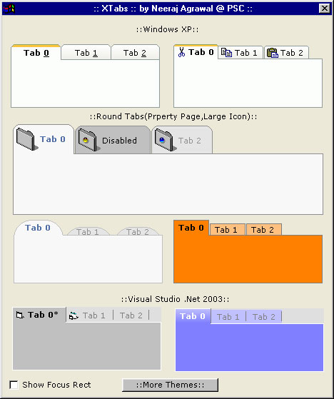



## \[\!\!\!\!\!  XTab a complete Tab ActiveX control written from scratch  Updated \-Now Supports Icons \!\!\!\!\!\]

### Description

XTab is an ActiveX Control which can be used as a substitute for the Microsoft Tabbed Dialog/Property Page Control. XTab uses subclassing to achieve same design-time switching effect as MS Tab control does. XTab is highly customizable and provides many standard themes like XP,Visual Studio 2003 .Net, Rounded Tabs, Owner Drawn, Iconed theme etc. And best of all it has no external dependencies to subclassing dlls or common dialog etc controls. Optimized code for flicker free drawing. New themes can be easily added by simply implementing the ITheme Interface. Featured Property Page for easily setting properties.

Supports Individual Tab Enabling/Disabling.

Now supports Icons in all the themes. Also we can use PictureSize,PictureAlignment and MaskColor property to customize the Interface. Updated Property page too for better UI. Added a method to allow copying images from any compatible ImageList Control.

email:

nja91@yahoo.com

neeraj_agrawal_ind@rediffmail.com

If you like the code please leave a comment/vote. :)
 
### More Info
 
uses subclassing... may crash VB if you try to debug without setting the IsDebug conditional compilation flag to true.

             |
---                |---
**Submitted On**   |2004-10-27 13:58:04
**By**             |[Neeraj Agrawal](https://github.com/Planet-Source-Code/PSCIndex/blob/master/ByAuthor/neeraj-agrawal.md)
**Level**          |Intermediate
**User Rating**    |4.9 (774 globes from 158 users)
**Compatibility**  |VB 5\.0, VB 6\.0
**Category**       |[OLE/ COM/ DCOM/ Active\-X](https://github.com/Planet-Source-Code/PSCIndex/blob/master/ByCategory/ole-com-dcom-active-x__1-29.md)
**World**          |[Visual Basic](https://github.com/Planet-Source-Code/PSCIndex/blob/master/ByWorld/visual-basic.md)
**Archive File**   |[\[\!\!\!\!\!\_\_XT183827192005\.zip](https://github.com/Planet-Source-Code/neeraj-agrawal-xtab-a-complete-tab-activex-control-written-from-scratch-updated-now-suppor__1-56462/archive/master.zip)

